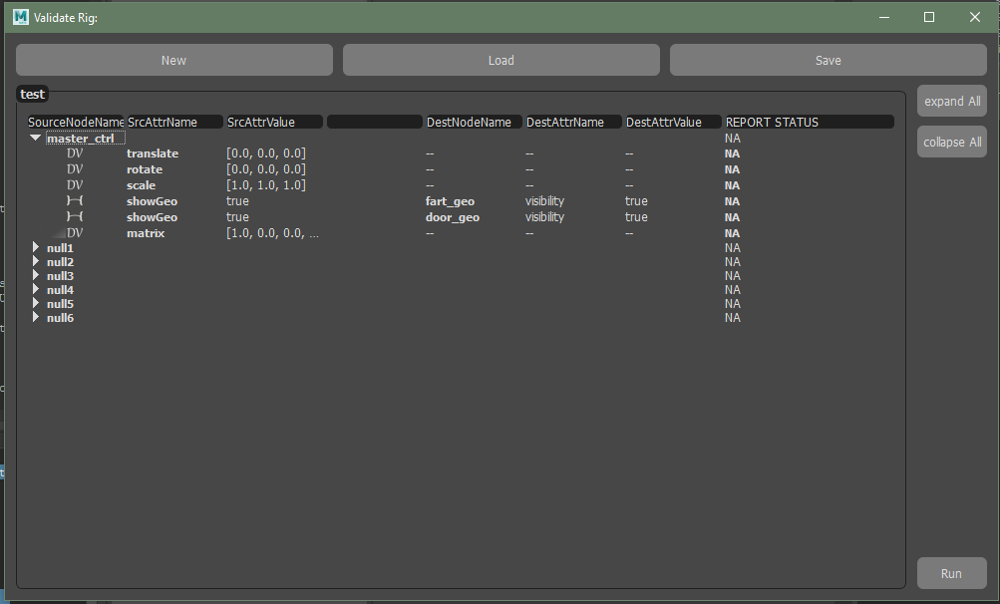
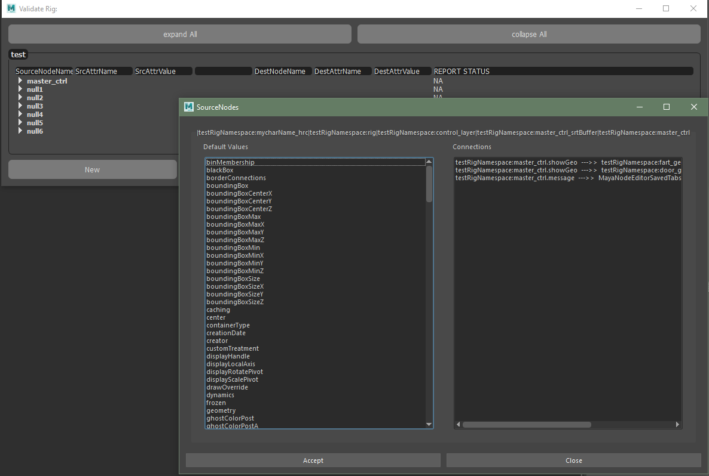

# validateRig

### Aims:

    - To create a UI that allows easy drag and drop to create a 
    validation of a rig against it's anticipated default values. We can 
    serialize a setup of default data from the UI to disk and load this 
    at anytime to check the rig is still consistent with this data 
    before delivery.
    
    - Easy setup of source ---> destination .attributes and their 
    anticipated state.
    
    - Easy library management of validation states for different rigs.
    
    
### Workflow:

The anticipate workflow would be for a rigger to load the rig. Manually
Set the default state of the rig as it is expected to be delivered.

Then leveraging the UI quickly create a snapshot of this state to store
to disk for later validation checking.

The tool can run in headless mode to provide the artist an opportunity to
nest the results in another tool or run the tool as a UI and provide
visual feedback on a validation check run on a scene in the DCC to fix 
issues as they see fit.

     

