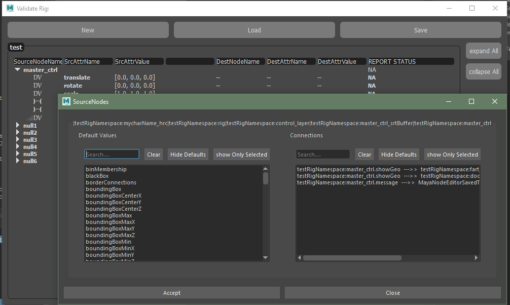

# validateRig

### Aims:

    - To create an API/UI that creates a validation of a rig's default
     value for controls, and connections information to validate.
    
    - Serialize data to disk and load this at anytime to validate the rig
    is still consistent with this data (before delivery).
    
    - Easy setup of source ---> destination .attributes and their 
    anticipated state.
    
    - Easy library management of validation states for different rigs.
    

### Nodes Notes
    Each ConnectionValidityNode will be considered a child of the sourceNode.
    This parent / child relationship holds everything we need to check a rig for validity.
    eg:
        myCtrlCrv has 2 attributes on it;
            - showCloth
            - headLock
    
        We can create a sourceNode of this ctrl curve.
        sourceNode = SourceNode(name="myCtrlCrv")
    
        Then can we create x# of ConnectionValidityNodes for EACH attribute we want to check is valid!
        eg:
        showCloth_geoHrc = ConnectionValidityNode(name="geo_hrc",
                                        attributeName="visibility", destAttrValue=True,
                                        srcAttrName="showCloth", srcAttrValue="True"
                                        )
        sourceNode.appendValidityNode(showCloth_geoHrc)
    
    It should also be noted we only serialize SourceNodes as ConnectionValidityNodes will be written as dependencies of 
    these
    to disk as part of the SourceNode data.

